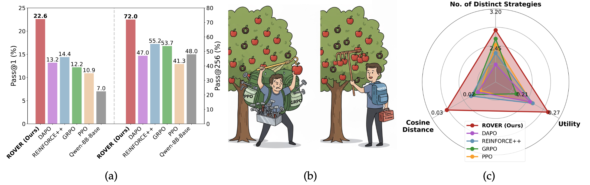

# <center> Random Policy Valuation is Enough for LLM Reasoning with Verifiable Rewards </center>
---
<p align="center">
<a href="https://arxiv.org/abs/2505.17618">
    
</a>
  <a href="https://x.com/tinner_he/status/1926939246876614735">
    
  </a>
</p>
This is the official repository for the paper [Random Policy Valuation is Enough for LLM Reasoning with Verifiable Rewards](https://arxiv.org/abs/2505.17618). This repository currently contains code for environment setup, training, and evaluation.

🚀 We propose <u>**R**</u>andom P<u>**o**</u>licy <u>**V**</u>aluation for Di<u>**v**</u>erse <u>**R**</u>easoning (**ROVER**), a minimalist and highly effective RL method for LLM reasoning, achieving superior optimality and diversity by evaluating uniform-policy Q-values.


### 🏆 Main Results and Features

<em>Figure 1: (a) ROVER achieves superior performances in terms of both pass@1 and pass@256 (trained on Qwen3-8B-Base averaged over AIME24, AIME24 and HMMT25 tasks). (b) Illustrative example demonstrating that ROVER achieves high-quality solutions with a lightweight procedure (see Table below for details) while maintaining diversity. (c) ROVER achieves higher diversity.</em> <br>
<br>
ROVER needs minimal GPU memory and computation cost, leaving more space for the KV cache. This allows ROVER to run on smaller memory setups and speeds up training:

| Method       | Memory Usage of Model Parameters                |
| ------------ | ----------------------------------------------- |
| ROVER (Ours) | **Low**&nbsp;&nbsp;&nbsp;&nbsp;&nbsp;&nbsp;&nbsp;&nbsp;(actor model ONLY!😊)                |
| GRPO         | **Medium** (actor + reference model)            |
| PPO          | **High**&nbsp;&nbsp;&nbsp;&nbsp;&nbsp;&nbsp;&nbsp;(actor + reference + critic model)   |


### 🤗 Models
| Models | Tasks | 
|:---------|:-----|
|[🤗ROVER-Qwen3-4B](https://huggingface.co/haoranhe/ROVER-Qwen3-4B)|Math Reasoning|
|[🤗ROVER-Qwen3-8B](https://huggingface.co/haoranhe/ROVER-Qwen3-8B)|Math Reasoning|
|[🤗ROVER-countdown-3B](https://huggingface.co/haoranhe/ROVER-countdown-3B)|Countdown Games|
### 🔧 Installation

This work considers two tasks for training and evaluating ROVER, which are countdown games for fine-grained analysis and more complex math reasoning tasks. Therefore, this project uses two separate environments for different tasks.

- For countdown tasks, you can follow the commands below:
```
cd Countdown
conda create -n rover-countdown python=3.9
pip3 install vllm==0.6.3
pip3 install ray
# verl
pip install -e .
# flash attention 2
pip3 install flash-attn --no-build-isolation
pip install wandb IPython matplotlib
```
- For math tasks:
```
cd Math
conda create -n rover-math python=3.12
pip install -e ./verl
pip install -e ./
pip install transformers==4.51.0
pip install vllm==0.8.4
pip install tensordict==0.6.2
 
```

### 🎯 Training
- For training a model to solve the countdown task, please download [Qwen2.5-3B](https://huggingface.co/Qwen/Qwen2.5-3B) and then set the model path in [`run.sh`](./Coundown/scripts/run.sh), and then try:
```
conda activate rover-countdown
cd Countdown
bash ./scripts/run.sh
```
- For math tasks, please download [Qwen3-8B-Base](https://huggingface.co/Qwen/Qwen3-8B-Base) model, and then try:
```
conda activate rover-math
cd Math
./scripts/deepscaler/train/rover_qwen3_8b.sh --model /path/to/qwen3-8b --wandb_api_key your_wandb_api_key
```
### 🔎 Evaluation
- Regarding the countdown task, you can follow the commands below to test the model's performance on the test set:
```
conda activate rover-countdown
cd Countdown
bash ./scripts/generate.sh
```
Note that before running the generation commands, you should first set the `BASE_OUTPUT_DIR`, `MODEL_BASE_PATH`, and `TEST_DATA_PATH` in the `generate.sh`.

- For math tasks, you can rollout on test set (use AIME24 as an example) and compute pass@$k$ as follows:
```
conda activate rover-math
cd Math/eval
bash ./gen_eval_pipeline.sh /path/to/trained/model AIME2024
python passk_comparison.py
```

### 👍 Acknowledgement
We thank the following open-source works:
- We follow [verl](https://github.com/volcengine/verl) and [DeepScaler](https://github.com/agentica-project/rllm) to build our codebase.
- We follow [TinyZero](https://github.com/Jiayi-Pan/TinyZero) for implementation the countdown task.
- We adopt the dataset provided by [DeepScaler](https://github.com/agentica-project/rllm) for training math reasoning models.
### 📖 Citation
If you find the project useful, please consider citing our paper:
```bib
@article{he2025randompolicyvaluation,
      title={Random Policy Valuation is Enough for LLM Reasoning with Verifiable Rewards}, 
      author={Haoran He and Yuxiao Ye and Qingpeng Cai and Chen Hu and Binxing Jiao and Daxin Jiang and Ling Pan},
      journal={arXiv preprint arXiv:},
      year={2025}
}
```
